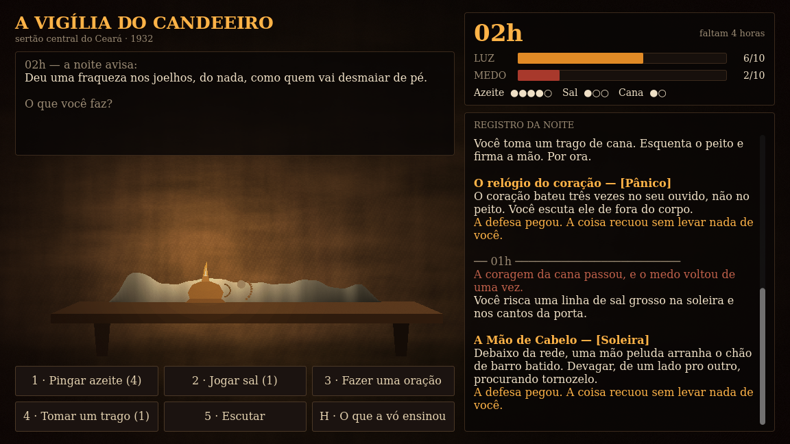

# A Vigília do Candeeiro

Jogo de turno em Godot 4.7. Sertão central do Ceará, 1932: morreu o velho da casa
e ninguém quis velar o corpo. Sobrou você, um candeeiro e oito horas de noite.

Trabalho da disciplina de Desenvolvimento de Jogos Digitais — temática do
semestre **"Noites Cabulosas no Ceará"**.



## Como jogar

Oito horas de vigília, das 22h às 05h. Em cada hora, uma ação:

| Tecla | Ação | Defende de |
|---|---|---|
| 1 | Pingar azeite (+3 Luz) | Sombra |
| 2 | Jogar sal na soleira | Soleira |
| 3 | Fazer uma oração (−3 Medo, −1 Luz extra) | Alma |
| 4 | Tomar um trago (−4 Medo, cobra 2 depois) | Pânico |
| 5 | Escutar (apanha menos e revela a hora seguinte) | — |
| H | Tela de regras | — |
| R | Velar outra noite | — |

**Perde** quem deixa a Luz chegar a 0 (o escuro entra) ou o Medo chegar a 10
(você corre pra noite). **Ganha** quem chega às 06h vivo, quando o galo canta.

A cada hora o pavio queima 1 de Luz e a noite acrescenta 1 de Medo, faça você o
que fizer. O presságio no começo da hora é a única pista do que vem — ler o
presságio é o jogo.

## Rodar

Abrir a pasta no Godot 4.7 e dar play. A cena inicial é `scenes/menu.tscn`.

## Estrutura

```
scenes/          menu.tscn e game.tscn
scripts/
  vigil.gd       as regras da noite — não conhece a tela
  night_event.gd uma assombração (tipo, dano, texto)
  event_deck.gd  as 17 assombrações e os presságios
  rules_text.gd  o texto das regras
  game.gd        a tela de jogo
  menu.gd        a tela de abertura
  lamp.gd        desenha a sala (mesa, corpo coberto, candeeiro, chama)
shaders/         parede de taipa e vinheta, procedurais
assets/audio/    14 sons, sintetizados por tools/gen_audio.py
tools/           geradores e testes automatizados
docs/            design, devlog e telas
```

Não há sprite nem sample de terceiros: imagem e som são gerados por código.

## Testes

```bash
G=~/Downloads/Godot_v4.7.2-stable_linux.x86_64
$G --headless --script tools/ui_test.gd --path .       # layout + partida completa
$G --headless --script tools/flow_test.gd --path .     # menu, teclado, troca de cena
$G --headless --script tools/balance_test.gd --path .  # 8000 noites simuladas
```

O balanceamento é medido, não estimado: quem lê os presságios vence ~71% das
noites, quem chuta vence 0,4%, e quem cuida de uma só das duas barras perde
sempre.

## Documentação

- [`docs/game-design.md`](docs/game-design.md) — regras, balanceamento e as lendas usadas
- [`docs/devlog-01.md`](docs/devlog-01.md) — devlog da disciplina
- [`docs/decisions.md`](docs/decisions.md) — decisões de projeto
